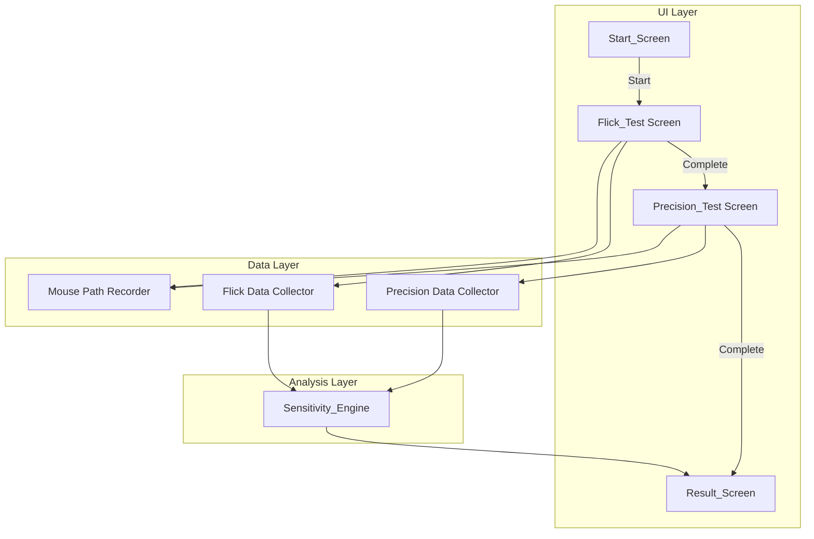
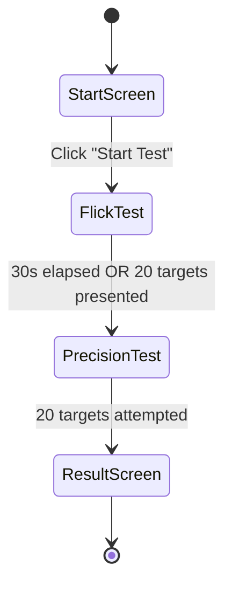

# Design Document: Aim Sensitivity Analyzer

## Overview

Aim Sensitivity Analyzer는 FPS 초보자를 위한 웹 기반 에임 테스트 및 감도 분석 도구이다. 사용자의 마우스 이동 패턴을 수집하고, rule-based 분석을 통해 Over_Aim, Under_Aim, Cursor_Jitter 경향을 판별하여 감도 조정 방향을 제시한다.

이 프로토타입은 프론트엔드 전용(React + Canvas)으로 구현하며, 게임 선택/감도 입력/DPI 입력 없이 핵심 테스트 기능에 집중한다. 향후 FastAPI 백엔드 통합을 고려하여 데이터 수집 모듈과 분석 엔진을 UI로부터 분리한다.

### Design Decisions

| Decision | Rationale |
|----------|-----------|
| React + Canvas (CRA or Vite) | 빠른 프로토타이핑, Canvas로 60fps 렌더링 가능 |
| Sensitivity_Engine을 순수 모듈로 분리 | 브라우저/React 의존 없이 단위 테스트 가능, 향후 백엔드 이식 용이 |
| 데이터 수집 모듈 분리 | UI 변경 없이 API 호출로 교체 가능 |
| requestAnimationFrame 기반 렌더링 | 브라우저 네이티브 60fps 보장 |
| Rule-based 분석 (AI/ML 없음) | 프로토타입 단계에서 예측 가능한 결과, 디버깅 용이 |
| Vite 빌드 도구 | CRA 대비 빠른 HMR, 간단한 설정 |

## Architecture

### High-Level Architecture



### Screen Flow



### Module Dependency Rules

- **UI Layer** → imports from Data Layer (to call collection functions)
- **UI Layer** → imports from Analysis Layer (Result_Screen only)
- **Data Layer** → NO imports from UI Layer
- **Analysis Layer** → NO imports from UI Layer or Data Layer
- **Analysis Layer** → receives data as function parameters only

## Components and Interfaces

### UI Components

#### `StartScreen`
```typescript
interface StartScreenProps {
  onStart: () => void;
}
```
- "Start Test" 버튼과 테스트 설명 텍스트 렌더링
- 버튼 클릭 시 `onStart` 콜백 호출

#### `FlickTestScreen`
```typescript
interface FlickTestScreenProps {
  onComplete: (data: FlickTestResult) => void;
}
```
- Canvas 렌더링, 타겟 생성/표시, 타이머/카운터 HUD
- Mouse_Path 수집을 위해 `MousePathRecorder` 사용
- 종료 조건(30초 또는 20타겟) 충족 시 `onComplete` 호출

#### `PrecisionTestScreen`
```typescript
interface PrecisionTestScreenProps {
  onComplete: (data: PrecisionTestResult) => void;
}
```
- 작은 타겟(8-15px 반지름) 순차 표시
- 클릭마다 다음 타겟으로 진행 (hit/miss 무관)
- 20개 완료 시 `onComplete` 호출

#### `ResultScreen`
```typescript
interface ResultScreenProps {
  flickData: FlickTestResult;
  precisionData: PrecisionTestResult;
}
```
- `Sensitivity_Engine`을 호출하여 분석 결과 표시
- 정확도 점수, 반응 시간, 경향 분류, 추천 표시

#### `GameCanvas`
```typescript
interface GameCanvasProps {
  width: number;
  height: number;
  onMouseMove: (e: MouseEvent) => void;
  onClick: (e: MouseEvent) => void;
  renderFrame: (ctx: CanvasRenderingContext2D, timestamp: number) => void;
}
```
- 공통 Canvas 래퍼 컴포넌트
- requestAnimationFrame 루프 관리
- 커스텀 크로스헤어 렌더링
- 프레임 레이트 모니터링

### Data Collection Modules

#### `flickDataCollector.ts`
```typescript
function createFlickDataCollector(): FlickDataCollector;

interface FlickDataCollector {
  recordTargetSpawn(target: TargetPosition): void;
  recordClick(click: ClickData): void;
  recordMouseSample(sample: MouseSample): void;
  finalize(): FlickTestResult;
}
```

#### `precisionDataCollector.ts`
```typescript
function createPrecisionDataCollector(): PrecisionDataCollector;

interface PrecisionDataCollector {
  recordTargetSpawn(target: TargetPosition): void;
  recordClick(click: ClickData): void;
  recordMouseSample(sample: MouseSample): void;
  finalize(): PrecisionTestResult;
}
```

#### `mousePathRecorder.ts`
```typescript
function createMousePathRecorder(): MousePathRecorder;

interface MousePathRecorder {
  startSegment(): void;
  addSample(x: number, y: number, timestamp: number): void;
  endSegment(): MousePathSegment;
  getCurrentSegment(): MouseSample[];
}
```

### Analysis Module

#### `sensitivityEngine.ts`
```typescript
function analyzeSensitivity(input: AnalysisInput): AnalysisResult;

interface AnalysisInput {
  flickData: FlickTestResult;
  precisionData: PrecisionTestResult;
}

interface AnalysisResult {
  tendencies: TendencyClassification[];
  accuracyScore: number;
  averageReactionTimeMs: number;
  overAimPercentage: number;
  recommendations: Recommendation[];
}

function detectOverAim(flickData: FlickTestResult): OverAimResult;
function detectUnderAim(precisionData: PrecisionTestResult): UnderAimResult;
function detectCursorJitter(precisionData: PrecisionTestResult): CursorJitterResult;
function calculateAccuracyScore(hitRate: number, avgReactionTimeMs: number): number;
function generateRecommendations(tendencies: TendencyClassification[]): Recommendation[];
```

## Data Models

### Core Types

```typescript
// 좌표 및 기본 타입
interface Point {
  x: number;  // Canvas 기준 픽셀 좌표
  y: number;
}

interface MouseSample {
  x: number;
  y: number;
  timestamp: number;  // 타겟 출현 시점 기준 밀리초
}

interface MousePathSegment {
  samples: MouseSample[];
  targetIndex: number;
}

// 타겟 정보
interface TargetPosition {
  center: Point;
  radius: number;
}

// 클릭 데이터
interface ClickData {
  position: Point;
  timestamp: number;       // 타겟 출현 기준 경과 밀리초
  absoluteTime: number;    // 테스트 시작 기준 밀리초
  isHit: boolean;
  targetIndex: number;
}
```

### Flick Test Data

```typescript
interface FlickTargetAttempt {
  target: TargetPosition;
  clicks: ClickData[];           // miss 포함 모든 클릭
  mousePath: MousePathSegment;
  overAimDetected: boolean;
  reactionTimeMs: number;        // 첫 번째 hit까지의 시간 (miss만이면 마지막 클릭 시간)
}

interface FlickTestResult {
  attempts: FlickTargetAttempt[];
  totalTimeMs: number;
  terminationReason: 'time' | 'targets';
}
```

### Precision Test Data

```typescript
interface PrecisionTargetAttempt {
  target: TargetPosition;
  click: ClickData;
  mousePath: MousePathSegment;
  cursorJitter: number;           // 클릭 전 200ms 내 누적 이동 거리 (px)
  correctionMovements: number;    // 45도 이상 방향 전환 횟수
}

interface PrecisionTestResult {
  attempts: PrecisionTargetAttempt[];
  hitCount: number;
  hitRate: number;                // 0-1 범위
}
```

### Analysis Result Types

```typescript
type TendencyType = 'over_aim' | 'under_aim' | 'cursor_jitter' | 'balanced';

interface TendencyClassification {
  type: TendencyType;
  severity: number;    // 0-1 범위, 임계값 초과 정도
  details: string;     // 사람이 읽을 수 있는 설명
}

interface Recommendation {
  tendency: TendencyType;
  direction: 'increase' | 'decrease' | 'maintain';
  reason: string;
}

interface AnalysisResult {
  tendencies: TendencyClassification[];
  accuracyScore: number;           // 0-100
  averageReactionTimeMs: number;
  overAimPercentage: number;       // 0-100
  recommendations: Recommendation[];
}
```

### Analysis Constants

```typescript
const ANALYSIS_CONSTANTS = {
  OVER_AIM_THRESHOLD: 0.5,           // 50% 이상 타겟에서 Over_Aim 발생 시
  OVER_AIM_MIN_OVERSHOOT_PX: 5,      // Over_Aim 판정 최소 초과 거리
  UNDER_AIM_CORRECTION_THRESHOLD: 3, // 평균 Correction_Movement > 3
  JITTER_DISTANCE_THRESHOLD: 15,     // 클릭 전 100ms 평균 이동 > 15px
  JITTER_WINDOW_MS: 200,             // Jitter 측정 윈도우
  JITTER_MEASUREMENT_POINT_MS: 100,  // Jitter 측정 기준점 (클릭 전 100ms)
  ACCURACY_HIT_WEIGHT: 0.7,
  ACCURACY_SPEED_WEIGHT: 30,
  MAX_REACTION_TIME_MS: 3000,        // 점수 계산 시 최대 반응 시간
  DIRECTION_CHANGE_ANGLE_DEG: 45,    // Correction_Movement 판정 각도
} as const;
```

## Correctness Properties

*A property is a characteristic or behavior that should hold true across all valid executions of a system—essentially, a formal statement about what the system should do. Properties serve as the bridge between human-readable specifications and machine-verifiable correctness guarantees.*

### Property 1: Hit detection correctness

*For any* target position with a given radius and *for any* click position, the hit/miss classification SHALL equal whether the Euclidean distance from the click position to the target center is less than or equal to the target radius.

**Validates: Requirements 2.2, 4.2, 5.1**

### Property 2: Target generation boundary constraint

*For any* canvas dimensions (width >= 800, height >= 600), *for any* target generated by the system with a given radius and margin requirement, the target center SHALL satisfy: `center.x - radius >= margin`, `center.x + radius <= width - margin`, `center.y - radius >= margin`, `center.y + radius <= height - margin`.

**Validates: Requirements 2.1, 4.1**

### Property 3: Consecutive target minimum distance

*For any* previous target center position and *for any* newly generated target position in the Flick_Test, the Euclidean distance between the two centers SHALL be at least 100 pixels.

**Validates: Requirements 2.3**

### Property 4: Flick test termination condition

*For any* combination of elapsed time (in milliseconds) and number of targets presented, the termination decision SHALL be true if and only if elapsed time >= 30000 OR targets presented >= 20.

**Validates: Requirements 2.5**

### Property 5: Over_Aim detection algorithm

*For any* mouse path (sequence of samples), initial cursor position, and target center, the Over_Aim detection SHALL return true if and only if the cursor's projected distance along the initial-to-target vector exceeded the target center distance and subsequently decreased by at least 5 pixels before the final sample.

**Validates: Requirements 3.5**

### Property 6: Cursor_Jitter calculation

*For any* sequence of mouse samples with timestamps, the Cursor_Jitter value SHALL equal the sum of Euclidean distances between consecutive samples whose timestamps fall within 200 milliseconds before the click timestamp.

**Validates: Requirements 5.2**

### Property 7: Correction_Movement counting

*For any* mouse path segment (sequence of at least 3 samples), the Correction_Movement count SHALL equal the number of consecutive direction vectors whose angle difference exceeds 45 degrees.

**Validates: Requirements 5.3**

### Property 8: Tendency classification thresholds

*For any* valid AnalysisInput, the Sensitivity_Engine SHALL classify tendencies such that: Over_Aim is present if and only if overAimCount/totalTargets > 0.5, Under_Aim is present if and only if average correctionMovements > 3, Cursor_Jitter is present if and only if average jitter distance > 15px, and Balanced is present if and only if none of the other three are present. All applicable classifications SHALL be reported together.

**Validates: Requirements 6.2, 6.3, 6.4, 6.6, 6.7**

### Property 9: Accuracy score formula and clamping

*For any* hit rate in [0, 1] and *for any* average reaction time >= 0, the accuracy score SHALL equal `clamp(hitRate * 100 * 0.7 + (1 - avgReactionTimeMs / 3000) * 30, 0, 100)`.

**Validates: Requirements 6.5**

### Property 10: Recommendation output completeness and ordering

*For any* set of detected tendencies with severity values, the generated recommendations SHALL contain exactly one recommendation per tendency, each including the tendency name, direction (increase/decrease/maintain), and a non-empty reason string, and SHALL be ordered by severity descending.

**Validates: Requirements 7.4, 7.6**

### Property 11: Result value formatting

*For any* accuracy score (0-100), average reaction time (>= 0), and Over_Aim percentage (0-100), the formatted output SHALL round the accuracy score to one decimal place, the reaction time to the nearest whole number, and the Over_Aim percentage to one decimal place.

**Validates: Requirements 7.7**

## Error Handling

### Canvas Errors

| Scenario | Handling |
|----------|----------|
| Canvas context unavailable | 에러 메시지 표시, 테스트 시작 차단 |
| requestAnimationFrame 미지원 | 폴백 없음, 브라우저 업그레이드 안내 |
| Canvas 크기 < 800x600 | 최소 크기로 강제 설정, 경고 표시 |

### Data Collection Errors

| Scenario | Handling |
|----------|----------|
| Mouse event 누락 (탭 전환 등) | 해당 구간 데이터 gap 표시, 분석 시 제외 |
| 타이머 정밀도 부족 | performance.now() 사용, Date.now() 폴백 |
| 메모리 부족 (긴 마우스 경로) | 샘플링 레이트 동적 감소 (60→30fps) |

### Analysis Errors

| Scenario | Handling |
|----------|----------|
| 데이터 부족 (0개 타겟 hit) | "데이터 부족" 메시지, 재시도 권유 |
| 비정상 값 (음수 시간 등) | 해당 시도 제외, 유효 데이터만 분석 |
| 모든 데이터 무효 | 분석 불가 메시지, Start_Screen으로 복귀 |

### Performance Degradation

| Scenario | Handling |
|----------|----------|
| FPS < 60 for > 500ms | 히트 이펙트 등 비필수 시각 효과 비활성화 |
| FPS < 30 | 마우스 샘플링 레이트 감소, 경고 표시 |

## Testing Strategy

### Testing Framework

- **Unit/Integration Tests**: Vitest (Vite 네이티브 지원, 빠른 실행)
- **Property-Based Tests**: fast-check (TypeScript 네이티브 PBT 라이브러리)
- **Component Tests**: React Testing Library + Vitest
- **Canvas Mocking**: jest-canvas-mock 또는 커스텀 Canvas 2D context mock

### Test Structure

```
src/
├── __tests__/
│   ├── unit/
│   │   ├── sensitivityEngine.test.ts      # 분석 엔진 단위 테스트
│   │   ├── hitDetection.test.ts           # 히트 판정 테스트
│   │   └── dataCollectors.test.ts         # 데이터 수집 모듈 테스트
│   ├── property/
│   │   ├── sensitivityEngine.prop.test.ts # 분석 엔진 속성 테스트
│   │   ├── hitDetection.prop.test.ts      # 히트 판정 속성 테스트
│   │   ├── targetGeneration.prop.test.ts  # 타겟 생성 속성 테스트
│   │   ├── overAimDetection.prop.test.ts  # Over_Aim 감지 속성 테스트
│   │   ├── cursorAnalysis.prop.test.ts    # Jitter/Correction 속성 테스트
│   │   └── formatting.prop.test.ts        # 결과 포맷팅 속성 테스트
│   └── component/
│       ├── StartScreen.test.tsx           # 시작 화면 컴포넌트 테스트
│       ├── FlickTestScreen.test.tsx       # 플릭 테스트 화면 테스트
│       ├── PrecisionTestScreen.test.tsx   # 정밀 테스트 화면 테스트
│       └── ResultScreen.test.tsx          # 결과 화면 컴포넌트 테스트
```

### Property-Based Testing Configuration

- **Library**: fast-check
- **Minimum iterations**: 100 per property
- **Tag format**: `Feature: aim-sensitivity-analyzer, Property {N}: {title}`

Each correctness property (Properties 1-11) maps to a dedicated property-based test file. The Sensitivity_Engine module is fully testable in isolation since it accepts data as parameters and returns results without side effects.

### Unit Test Focus Areas

- Hit detection edge cases (exactly on boundary, floating point precision)
- Over_Aim detection with degenerate paths (single sample, zero-length path)
- Accuracy score clamping at boundaries (0 and 100)
- Termination condition edge cases (exactly 30s, exactly 20 targets)
- Empty/minimal data handling

### Component Test Focus Areas

- Start_Screen button rendering and click handling
- Timer/counter display updates
- Screen navigation flow
- Canvas rendering initialization
- Custom crosshair cursor display

### Test Execution

```bash
# 전체 테스트 실행
npm test

# 속성 테스트만 실행
npm run test:property

# 단위 테스트만 실행
npm run test:unit

# 컴포넌트 테스트만 실행
npm run test:component
```

